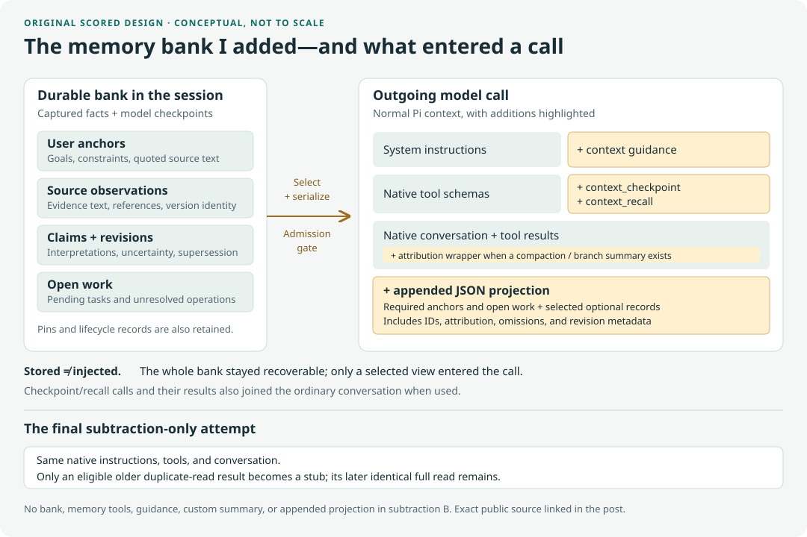

# What went into each call?

`index.html` is a standalone interactive viewer. Download and open it, or serve this directory locally. No external libraries, telemetry, credentials, or model calls are needed.

The public export covers 36 original Sol/Astra/Qwen run records and all ten final subtraction assignments. Original repair and persistence diagnostics are intentionally omitted. Select an experiment, model, workload, and request, or use the four suggested comparisons.

## The design behind the measurements



This diagram describes the original scored code, not the repaired preview. It shows logical components and message order, not token proportions.

## Evidence boundaries

- `data.json` contains only allowlisted numeric measurements, fixed labels, and booleans. No prompt text, source excerpts, raw identifiers, private hashes, timestamps, or machine paths are included.
- Original token categories use the provider's attribution, grouped by inferred item types. Counts reconcile to input, but cannot isolate the exact projection. Native history is a timestamp-based reconstruction, not wire capture; summary requests can differ. Memory counts are cumulative stored records, not injected payloads.
- Final shapes preserve item order, serialized item bytes, and pruning markers from transport telemetry. Separately supplied instructions/tool schemas are outside the byte strip. Item bytes are not token counts.
- Unchanged prefixes compare item hashes privately during export. This is distinct from reported cached tokens and does not prove caching.
- Null means unavailable. Reasoning is included in output. Failed and denied attempts are retained. A/B call ordinals are different trajectories, not aligned steps.
- Underlying raw traces are private. Public checks validate schema/arithmetic and consistency with released aggregates, not independent reproduction of trace judgments.

Rebuild after editing the template or public data:

```sh
node scripts/build-context-viewer.mjs
node scripts/verify-context-viewer.mjs
```

The blog embeds a byte-identical copy at `static/experiments/pi-context/context-shapes.html` using the companion `pi-context-viewer.html` Hugo shortcode. The post remains a draft until its owner publishes it.
